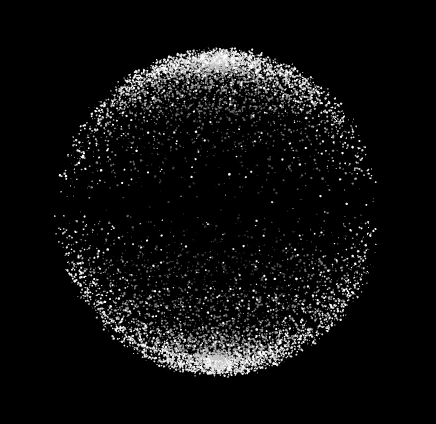
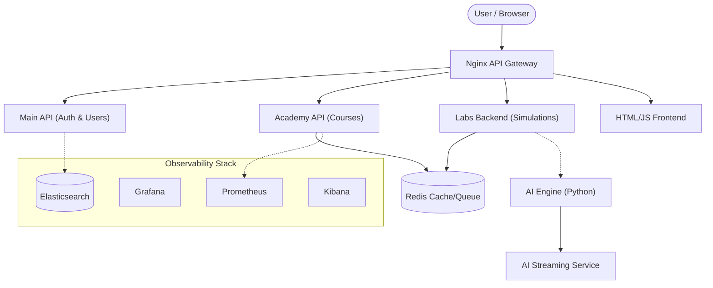

<div align="center">
  
  <h1>🛡️ Deephunt Enterprise Security Platform</h1>
  <p><strong>Next-Generation Cybersecurity Training & Operations Ecosystem</strong></p>
  
  [](https://github.com/Prateek-cyber45/Deephunt)
  [](https://www.docker.com/)
  [](https://opensource.org/licenses/MIT)
  [](https://www.python.org/)
  [](https://nodejs.org/)
</div>

---

## 📖 Overview

Deephunt is a comprehensive, enterprise-grade cybersecurity simulation and training ecosystem. Built on a microservices architecture, it provides an unparalleled environment for both **Offensive Security (Red Team)** and **Defensive Security (Blue Team)**.

Unlike traditional platforms that focus solely on IT infrastructure, Deephunt introduces specialized **Operational Technology (OT)** and **Industrial Control Systems (ICS)** simulations—including Aviation, Water Treatment, and SCADA environments—allowing professionals to train against high-stakes, physical-world threats.

## ✨ Key Features

- **🛡️ End-to-End Enterprise Architecture:** Microservices-based design mimicking real-world cloud-native infrastructures.
- **🏭 OT & ICS Simulations:** Specialized labs for SCADA, Aviation, Water, and Banking sectors.
- **👁️ Deep Observability Stack:** Integrated ELK (Elasticsearch, Logstash, Kibana), Prometheus, and Grafana for blue team monitoring.
- **🤖 AI-Driven Scenarios:** Dynamic, adaptive challenges powered by a dedicated AI-engine.
- **🐳 Fully Containerized:** One-command deployment via Docker Compose ensuring environment parity.

## 🏗️ Architecture

Deephunt follows a robust microservices pattern to isolate workloads and enable horizontal scaling.



## 📂 Project Structure

```text
├── .github/                 # CI/CD Workflows
├── academy-api/             # Course metadata & learning progression API
├── ai-engine/               # Adaptive AI processing core
├── ai-stream/               # WebSocket/Streaming engine for AI features
├── html_stack/              # Frontend templates & simulation UIs
├── labs-backend/            # Lab deployment & orchestration service
├── main-api/                # Core platform backend (User Auth)
├── nginx/                   # Reverse proxy configuration
├── observability/           # ELK, Prometheus, and Grafana configurations
├── redis-local/             # Redis caching and message brokering
└── docker-compose.yml       # Docker orchestration root
```

## 🚀 Getting Started

### Prerequisites
- [Docker](https://docs.docker.com/get-docker/) & [Docker Compose](https://docs.docker.com/compose/install/)
- [Node.js](https://nodejs.org/) (for local development)
- [Python 3.11+](https://www.python.org/)

### Quick Start Deployment

Deploy the entire microservices ecosystem with a single command:

```bash
# Clone the repository
git clone https://github.com/Prateek-cyber45/Deephunt.git
cd Deephunt

# Start the ecosystem using Docker Compose
docker-compose up --build -d
```

### Access Points
- **Frontend Dashboard:** `http://localhost:80`
- **Main API:** `http://localhost:80/api/main`
- **Kibana (Observability):** `http://localhost:5601`
- **Grafana (Metrics):** `http://localhost:3000`

## 🎯 Use Cases & Simulations

### 1. Security Operations Center (SOC) Simulator
Train Tier-1 SOC analysts with an interactive dashboard displaying mock alerts, incident maps, and threat feeds to mitigate alert fatigue.

### 2. SCADA / Water Treatment Simulators
Interact with frontend views mimicking real-world industrial control panels. Launch simulated attacks to see pressure valves fail, then deploy mitigation strategies.

### 3. Splunk Navigation
A mock SIEM interface allowing students to practice SPL (Search Processing Language) queries for incident response without expensive enterprise licenses.

---
<div align="center">
  <i>Built with passion by the Deephunt Team</i>
</div>
