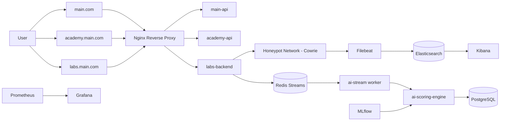

# CyberPlatform / DeepHunt — Presentation Deck

## 1) Project Overview
- **Project Name:** CyberPlatform (brand concept: DeepHunt)
- **Type:** Full-stack cybersecurity training platform
- **Core Idea:** Combine learning, live cyber simulations, and AI-based scoring in one ecosystem
- **Deployment Model:** Docker Compose microservices behind Nginx reverse proxy
- **Primary Domains:** `main.com`, `academy.main.com`, `labs.main.com`, `api.main.com`

---

## 2) Specific Objective
- Build a practical cyber training platform that closes the gap between theory and real SOC/IR operations.
- Provide **measurable learner performance** using:
  - `R_score` (response quality)
  - `B_score` (behavior integrity)
  - fused `Final Score`
- Enable organizations to train individuals and teams in safe, isolated, production-like environments.

---

## 3) Key Features
- **Academy LMS**: Courses, quizzes, progress tracking, certificates
- **Cyber Range Labs**: SOC simulation + Incident Response scenarios
- **Honeypot Integration**: Cowrie (and planned Dionaea extension) for realistic telemetry
- **AI Dual Scoring Engine**:
  - Semantic answer scoring (Sentence-BERT/spaCy fallback logic)
  - Behavioral anomaly scoring (Isolation Forest)
- **Live Score Widget** in labs (near real-time updates)
- **SIEM + Monitoring**: Elasticsearch/Kibana + Prometheus/Grafana
- **Role-based access** with cross-subdomain auth model

---

## 4) Progress Summary
### Current Status
- ✅ Core microservice architecture defined and containerized
- ✅ Main frontend, academy frontend, labs frontend integrated into gateway routing
- ✅ Main API, academy API, labs backend service structure in place
- ✅ Shared infrastructure (Postgres, Redis, ELK, Prometheus, Grafana, MLflow) configured
- ✅ Dark theme migration completed across frontends (implementation report completed)
- ✅ Lab telemetry + scoring pipeline code implemented (Redis stream processor + scoring service codebase)

### In Progress / Pending Activation
- ⏳ AI scoring containers in compose are currently commented and pending runtime activation
- ⏳ End-to-end production hardening, final QA, and deployment validation

---

## 5) Detailed Progress — Development Phase
### Phase 1: Foundation & Infrastructure
- Designed Docker Compose topology with isolated networks:
  - `frontend-net`
  - `data-net`
  - `honeypot-net` (internal)
- Set up Nginx reverse proxy for domain-based routing.
- Added secrets-based configuration for DB and JWT key handling.

### Phase 2: Core Product Development
- Implemented frontend experiences for:
  - Main platform shell
  - Academy learning flows
  - Labs simulation flows
- Implemented backend APIs for platform orchestration and learning workflows.

### Phase 3: Intelligence Layer
- Built `R_score` response quality module.
- Built `B_score` behavior anomaly module.
- Implemented fusion logic with adaptive weights by task type.
- Implemented stream processor for Redis event ingestion.

### Phase 4: Observability & Security Operations
- Integrated Filebeat → Elasticsearch → Kibana flow for honeypot logs.
- Added Prometheus and Grafana for service observability.

### Phase 5: UX / UI Standardization
- Completed dark-mode design rollout across active frontends.
- Updated design tokens, accessibility contrast, and cross-domain navigation consistency.

---

## 6) Methodology
- **Architecture Style:** Microservices + event-driven telemetry
- **Development Model:** Incremental module delivery (frontend, backend, AI, observability)
- **Data Flow Strategy:** Redis Streams for near real-time event transport
- **Scoring Strategy:** Hybrid approach
  - Supervised-style reference comparison for response quality
  - Unsupervised anomaly detection for behavioral integrity
- **Validation:** Component-level checks + integration walkthroughs + container-level testing

---

## 7) Prototype / Project Flow Diagram / Architecture

---

## 8) Project Timeline
| Timeline | Milestone | Status |
|---|---|---|
| Week 1–2 | Architecture design + container orchestration baseline | ✅ Completed |
| Week 3–5 | Frontend shells + APIs + routing | ✅ Completed |
| Week 6–7 | Labs backend + telemetry stream integration | ✅ Completed |
| Week 8–9 | AI scoring engine modules (R/B/Fusion) | ✅ Completed (code level) |
| Week 10 | SIEM + monitoring integration | ✅ Completed |
| Week 11 | UI dark-theme standardization & polish | ✅ Completed |
| Week 12 | End-to-end hardening, staging validation, release prep | ⏳ Active |

---

## 9) Next Steps and Goals
- Enable AI scoring and stream worker containers in Compose for full runtime flow.
- Finalize production security hardening:
  - secret management and rotation
  - stricter network policies
  - auth and role-policy validation
- Complete full regression test matrix across all domains.
- Add training-data lifecycle and model improvement loop.
- Prepare release candidate and deployment runbook.

---

## 10) Data & Resources
### Data Sources
- User interactions from LMS and Labs modules
- Lab telemetry events (commands, timing, behavioral signals)
- Honeypot logs (Cowrie JSON stream)
- Infrastructure metrics (Prometheus)

### Core Resources / Stack
- **Frontend:** Next.js
- **Backend:** FastAPI/Python services
- **DB/Cache/Event bus:** PostgreSQL, Redis, Redis Streams
- **AI/ML:** sentence-transformers, spaCy, scikit-learn, MLflow
- **Ops/Observability:** Docker Compose, Nginx, Elasticsearch, Kibana, Prometheus, Grafana

---

## 11) Project Use Cases & Scope
### Primary Use Cases
- Cybersecurity learner upskilling (SOC, IR, Threat Hunting)
- Team performance benchmarking for enterprises
- Realistic practical assessments with anti-cheating behavior checks
- Instructor/admin visibility via SIEM and metrics dashboards

### Scope
- In scope:
  - Training platform UX
  - Labs + telemetry
  - AI-assisted scoring
  - Monitoring and operational observability
- Out of scope (current release):
  - Full blockchain certification workflows
  - Large-scale multi-region orchestration
  - Advanced auto-remediation workflows

---

## 12) Expected Results & Impact
- Faster transition from classroom knowledge to operational readiness
- Quantifiable and auditable cybersecurity skill assessment
- Better team capability mapping for hiring and training decisions
- Improved cyber defense preparedness through realistic simulation practice
- Foundation for continuous skill intelligence at organization level

---

## 13) Thank You!!!!!!!!!!!
### Thank you for reviewing CyberPlatform / DeepHunt.
- Questions and feedback are welcome.
- Ready for demo walkthrough and technical Q&A.
